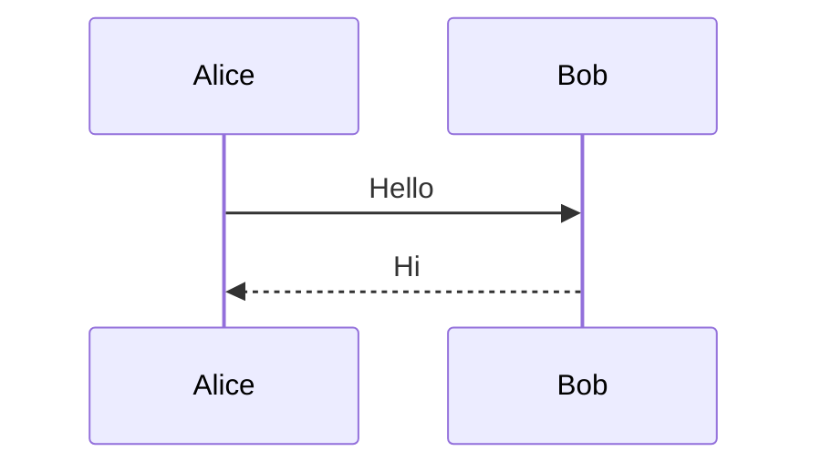

# Markdown 转 Word（含 Mermaid 图）

将 Markdown 文件转换为 Word 文档，自动将 Mermaid 语法块渲染为图片并嵌入。

## 快速用法

```bash
pandoc -F mermaid-filter input.md -o output.docx
```

- `-F mermaid-filter`：启用 mermaid 过滤器，将 ` ```mermaid ` 代码块转为图片
- 输入：`.md` 文件
- 输出：`.docx` 文件

## 前置要求

1. **pandoc**：`sudo pacman -S pandoc` 或从 https://pandoc.org/installing.html 安装
2. **mermaid-filter**：`npm install -g mermaid-filter`（需 Node.js）

验证安装：
```bash
pandoc --version && which mermaid-filter
```

## 工作流程

1. 确认输入 `.md` 文件路径
2. 确定输出 `.docx` 路径（可省略扩展名，pandoc 会根据 `-o` 推断）
3. 执行：`pandoc -F mermaid-filter <input.md> -o <output.docx>`

## Mermaid 代码块格式

Markdown 中标准写法：

````

````

过滤器会自动将上述块渲染为 PNG 图片并嵌入到 docx 中。

### 可选属性

在代码块后可加 Pandoc 属性：

- `{.mermaid format=svg}`：输出 SVG（默认 PNG，docx 通常用 PNG）
- `{.mermaid width=400}`：设置图片宽度（默认 800）
- `{.mermaid caption="图说明"}`：添加图片标题

## Windows 注意

Windows 下使用 `mermaid-filter.cmd`：

```bash
pandoc -F mermaid-filter.cmd input.md -o output.docx
```

## 更多选项

详见 [reference.md](reference.md)。
