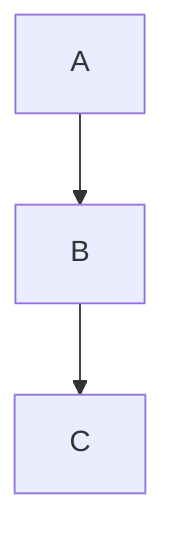
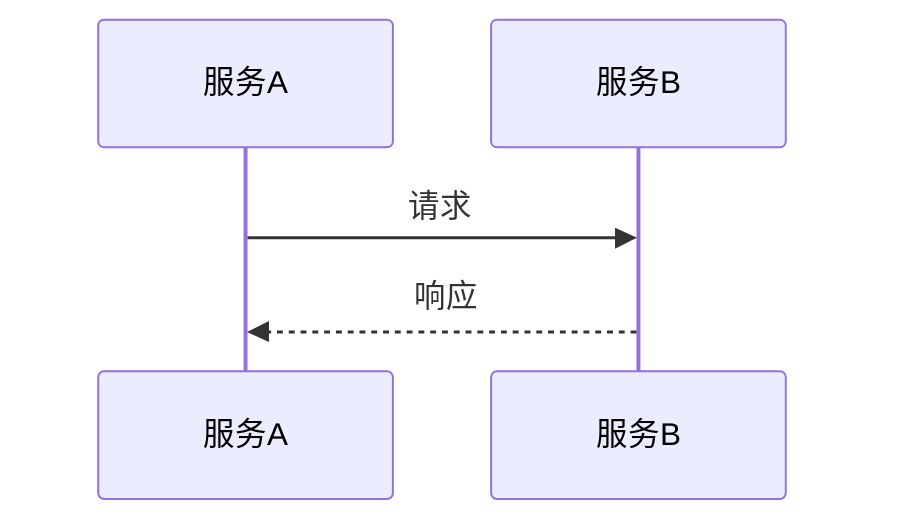

# 技术方案文档编写

根据用户提供的需求描述、相关表结构、方法调用及代码上下文，输出符合标准模板的完整技术方案。必须包含精细的业务流程图、时序图，以及对各业务模块与代码预期调整的详细备注。

## 输入要求

向用户收集或从对话中提取：

- **需求描述**：解决什么问题、PRD 概述
- **表结构**：相关数据表字段、索引、关系
- **方法/接口**：关键方法签名、调用链、API 设计
- **代码模块**：涉及的目录、包、文件

## 输出模板

严格按以下结构组织文档，各节均需充实内容：

```markdown
# [方案标题]

## 需求梳理

解决什么问题？确保正确理解需求，是 PRD 的概述。

## 技术方案

使用流程图、时序图、领域模型、数据表、接口设计、交互页面等方式描述清楚。

## 关键逻辑和影响范围

提炼技术方案最关键的部分、最有难度和风险的部分或影响范围。

| 逻辑点 | 说明 |
|--------|------|
| ... | ... |

影响范围：涉及的表、模块、依赖等。

## 发布策略

## Checklist

技术方案涉及的任务清单、检查点（如：需要刷数据）。
```

## 图表规范

### 流程图（flowchart）

用于整体架构、业务流程、状态流转。

- 整体架构：`flowchart TB`，区分外部系统与内部模块
- 业务主流程：关键节点、分支、失败路径
- 状态机：`stateDiagram-v2`，标明各状态转换条件

### 时序图（sequenceDiagram）

用于关键业务流程的参与者交互。

- 必须包含：参与者、请求/响应、分支（alt/else）、循环（loop）
- 标注异常路径与补偿逻辑
- 每个业务主流程至少一张时序图

### Mermaid 语法

````



````

## 各节编写要点

| 节 | 要点 |
|----|------|
| 需求梳理 | 用列表概括核心问题与约束，引用 PRD 关键点 |
| 技术方案 | 先图后表；流程图说明架构，时序图说明交互，数据表给出字段与索引 |
| 关键逻辑 | 表格列出逻辑点与说明，突出异常分支、幂等、重试、死信 |
| 影响范围 | 列出复用/新增/修改的表、模块路径、依赖包 |
| 发布策略 | 灰度、回滚、监控 |
| Checklist | 可执行任务，每条对应具体实现点（如 migration、方法名） |

## 代码与模块备注

技术方案中涉及代码调整时，必须给出：

- **目录与文件**：预期新增/修改的文件路径
- **方法/函数**：关键方法名、职责简述
- **表变更**：migration 描述（新增表、加字段、索引）

示例：

```
新增：apps/dotsync/jobs/question_sync_fetch.go → QuestionSyncFetch 执行 FetchFromA
修改：dot_question 表增加 source 字段 migration
```

## 完整示例参考

详见 [template-example.md](template-example.md)。
