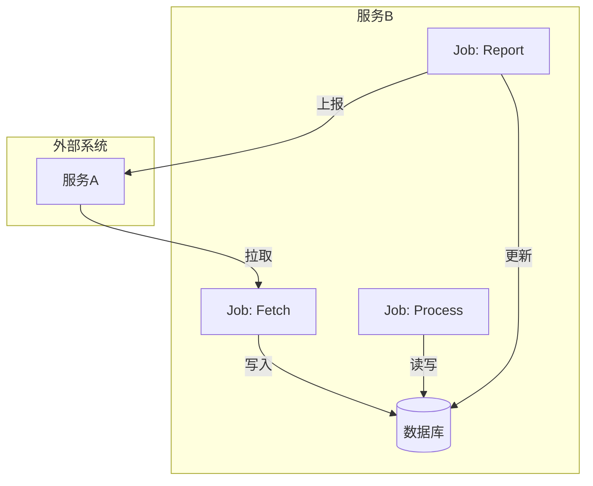
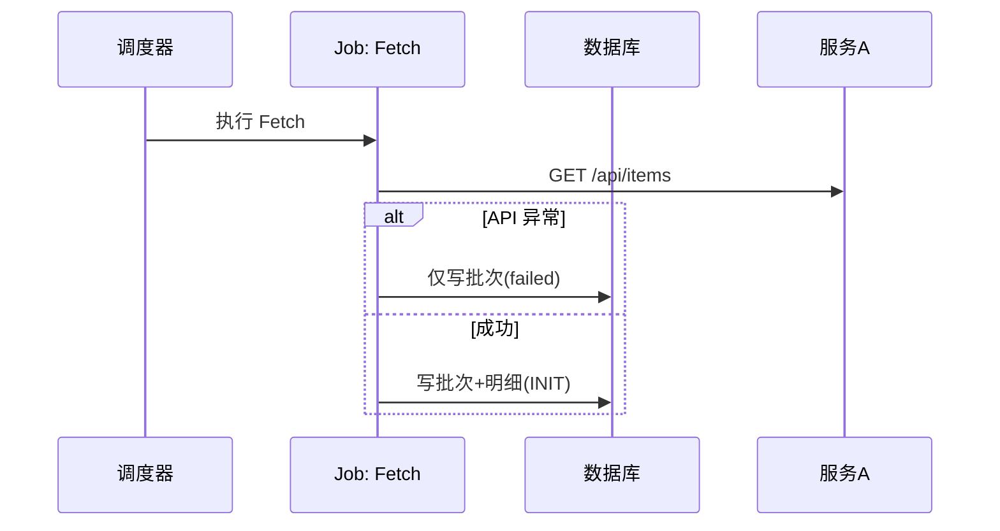

# 技术方案示例（结构参考）

以下为符合模板的完整示例结构，供 Agent 参考各节的写法与图表粒度。

---

## 需求梳理

### 解决什么问题？

- **拉取方向**：B 定时从 A 拉取数据，需做字段转换与清洗
- **上报方向**：B 落库后异步回传结果给 A
- **可靠性**：防宕机丢数据、单条毒药不卡整批、API 异常可追溯

**PRD 概述**：主从表解耦——主表记录批次，从表追踪单题。支持失败重试与死信隔离。

---

## 技术方案

### 整体架构（flowchart）



### 业务时序图（sequenceDiagram）



### 数据表设计

| 表名               | 字段                                            | 说明     |
| ------------------ | ----------------------------------------------- | -------- |
| core_jobs          | id, job_uuid, purpose, job_status, extra...     | 批次日志 |
| dot_sync_questions | id, job_id, a_data_id, status, b_question_id... | 单题明细 |

### 接口设计

| 项目 | 内容                                      |
| ---- | ----------------------------------------- |
| 拉取 | GET /api/questions?limit&last_update_time |
| 上报 | POST /api/questions/report                |

### 目录与代码组织

```
apps/dotsync/
  jobs/ question_sync_fetch.go   # FetchFromA
  service/ sync_service.go      # ProcessData, ReportToA
  models/ sync_question.go      # dot_sync_questions
```

---

## 关键逻辑和影响范围

| 逻辑点             | 说明                                             |
| ------------------ | ------------------------------------------------ |
| API 异常分支       | Fetch 失败时仅写 core_jobs，不写明细，游标不推进 |
| 单条失败不影响整批 | Process 内 goodList/badList 分离，事务提交       |
| 死信隔离           | 转换失败、上报超 5 次 → DEAD_LETTER             |

**影响范围**：复用 core_jobs；新增 dot_sync_questions；修改 dot_question 加 source；新建 dotsync 模块。

---

## 发布策略

- 灰度：先对部分租户开启
- 回滚：停止 Job 调度
- 监控：INIT 积压、DEAD_LETTER 数量、失败率

---

## Checklist

- [ ] dot_question 增加 source 字段 migration
- [ ] 新增 dot_sync_questions 建表 migration
- [ ] 实现 FetchFromA，含 API 异常分支
- [ ] 实现 ProcessData：INIT→B_SAVED/DEAD_LETTER
- [ ] 实现 ReportToA：指数退避与 DEAD_LETTER
- [ ] 注册三个具名 Job
- [ ] 单元测试：goodList/badList、API 异常分支
